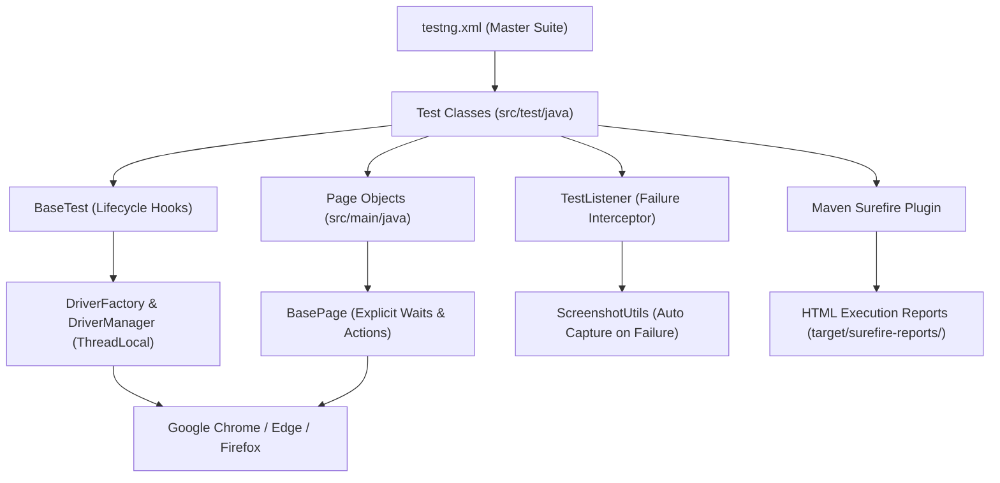

# ⏱️ Timeflow Selenium Test Automation Framework

[](https://openjdk.org/)
[](https://www.selenium.dev/)
[](https://testng.org/)
[](https://github.com/darshanhujband8055/timeflow-selenium-automation/actions/workflows/ci.yml)
[](https://timeflow.setoo.in)

An enterprise-grade, scalable End-to-End Test Automation Framework built with **Java**, **Selenium WebDriver 4**, **TestNG**, and the **Page Object Model (POM)**. It comprehensively tests all **4 User Roles and Business Modules** on the Setoo **Timeflow** platform (`https://timeflow.setoo.in`).

---

## 📑 Table of Contents
1. [Platform & Role Overview](#-platform--role-overview)
2. [Framework Architecture & Flow](#-framework-architecture--flow)
3. [⚡ Quick Start (Zero-Setup 1-Click Run)](#-quick-start-zero-setup-1-click-run)
4. [Targeted Execution Commands](#-targeted-execution-commands)
5. [Viewing Test Reports & Artifacts](#-viewing-test-reports--artifacts)
6. [Repository Structure](#-repository-structure)
7. [Configuration Settings](#-configuration-settings)
8. [Git & Collaboration Workflow](#-git--collaboration-workflow)
9. [🚀 CI/CD Pipelines (GitHub Actions & Azure DevOps)](#-cicd-pipelines-github-actions--azure-devops)
10. [Troubleshooting & FAQ](#-troubleshooting--faq)

---

## 👥 Platform & Role Overview

The framework validates access control, security guards, core workflows, and role-specific views across 4 primary personas:

| # | User Role | Default Credentials | Primary Modules & Scope Verified |
|---|---|---|---|
| **1** | **Standard Employee** | `shubham.shinde@setoo.co`<br/>`Pass@123` | • Timesheets (Daily, Weekly, Monthly view toggles)<br/>• "Sync My Tasks" trigger & "Save draft"<br/>• Submit week modal & zero-hour validation<br/>• Tasks, Project Allocations & Calendar views |
| **2** | **Reporting Manager** | `rutuja@setoo.co`<br/>`Pass@123` | • Team Approvals Queue & Batch Actions<br/>• Team Directory, Member roles & Skills<br/>• Reports generation, date filters & CSV exports<br/>• Resource Bandwidth, Allocations & Utilization |
| **3** | **Project Manager (PM)** | `rohan@setoo.co`<br/>`Pass@123` | • Projects management, project list & status<br/>• Billing & Budget Dashboard (`/billing`)<br/>• Financial stat cards: Planned, Consumed, Revenue<br/>• Budget mutation guards (TC 1.3 - PM mutation blocked) |
| **4** | **Administrator (Admin)** | `darshan@setoo.co`<br/>`Pass@123` | • Full organizational master privileges & Admin badge<br/>• Dashboard analytics tabs (Overview, Approvals, Submissions)<br/>• Administration & Organization Settings (`/settings`)<br/>• Master access to Projects, Billing, and Approvals |

---

## 🏗️ Framework Architecture & Flow

The framework follows strict Page Object Model (POM) separation:



---

## ⚡ Quick Start (Zero-Setup 1-Click Run)

### Prerequisites:
- **Java JDK 17 or higher** installed (`java -version`).
- **Google Chrome** browser installed.
- *(Maven is NOT required to be installed manually; the included Maven Wrapper handles it automatically!)*

---

### Method 1: 1-Click Run on Windows (Recommended for Managers)
Simply **double-click** the file:
```cmd
run-all-tests.bat
```
*This automatically downloads dependencies, runs all 52 tests visibly in Google Chrome, and produces HTML reports.*

---

### Method 2: 1-Click Run on macOS / Linux
Open terminal in the project directory and run:
```bash
chmod +x run-all-tests.sh
./run-all-tests.sh
```

---

### Method 3: Command Line via Maven Wrapper
```bash
# Clone the repository:
git clone <repo-url>
cd "timeflow selenium"

# Execute all tests:
./mvnw clean test

# Or if you have standard Maven installed on your machine:
mvn clean test
```

---

### Method 4: Run via IDE (IntelliJ IDEA / VS Code / Eclipse)
1. Open your IDE and click **Open Folder** -> Select `timeflow selenium`.
2. Allow Maven to import dependencies from `pom.xml`.
3. Right-click on **`testng.xml`** in the project root.
4. Click **Run 'testng.xml'**.

---

## 🎯 Targeted Execution Commands

You can selectively run specific roles, test classes, or configurations:

```bash
# 1. Run only Employee tests:
./mvnw test -Dtest=EmployeeModuleTest,EmployeeTimesheetWorkflowTest

# 2. Run only Manager tests:
./mvnw test -Dtest=ManagerModuleTest

# 3. Run only Project Manager tests:
./mvnw test -Dtest=PMModuleTest

# 4. Run only Administrator tests:
./mvnw test -Dtest=AdminModuleTest

# 5. Run only Role-Based Access Control (Security) tests:
./mvnw test -Dtest=AccessControlAndPermissionsTest

# 6. Run Headless mode (no visible browser window, ideal for CI/CD):
./mvnw clean test -Dheadless=true

# 7. Run on Microsoft Edge or Mozilla Firefox:
./mvnw clean test -Dbrowser=edge
./mvnw clean test -Dbrowser=firefox
```

---

## 📊 Viewing Test Reports & Artifacts

### 1. HTML Test Execution Report
After execution, open this file in any browser to inspect pass/fail statistics, run times, and stack traces:
```
target/surefire-reports/index.html
```
*(or the summary view: `target/surefire-reports/emailable-report.html`)*

### 2. Failure Screenshots
If any test assertion fails, Selenium automatically captures a full-screen screenshot timestamped in:
```
target/screenshots/
```

### 3. Module-Wise Defect Audit Reports (PDF)
Located in the project root:
- [Timeflow_Defect_Report_Employee_Module.pdf](file:///c:/Users/HP/Desktop/strix/timeflow%20selenium/Timeflow_Defect_Report_Employee_Module.pdf)
- [Timeflow_Defect_Report_Manager_Module.pdf](file:///c:/Users/HP/Desktop/strix/timeflow%20selenium/Timeflow_Defect_Report_Manager_Module.pdf)
- [Timeflow_Defect_Report_PM_Module.pdf](file:///c:/Users/HP/Desktop/strix/timeflow%20selenium/Timeflow_Defect_Report_PM_Module.pdf)
- [Timeflow_Defect_Report_Admin_Module.pdf](file:///c:/Users/HP/Desktop/strix/timeflow%20selenium/Timeflow_Defect_Report_Admin_Module.pdf)

---

## 📁 Repository Structure

```
timeflow selenium/
├── pom.xml                                // Maven dependencies & build plugins
├── testng.xml                             // TestNG Suite config (All 52 tests mapped)
├── mvnw / mvnw.cmd                        // Maven Wrapper executables
├── run-all-tests.bat                      // 1-Click Windows execution script
├── run-all-tests.sh                       // 1-Click macOS/Linux execution script
├── README.md                              // Documentation & onboarding guide
├── .gitignore                             // Excludes build targets and temporary caches
├── Timeflow_Defect_Report_*.pdf           // Module-wise QA Defect Reports
└── src/
    ├── main/
    │   ├── java/com/timeflow/
    │   │   ├── constants/
    │   │   │   └── FrameworkConstants.java // Timeouts, paths, file locations
    │   │   ├── driver/
    │   │   │   ├── DriverFactory.java     // Instantiates Chrome, Firefox, Edge
    │   │   │   └── DriverManager.java     // ThreadLocal WebDriver storage
    │   │   ├── pages/                     // Page Object Model classes
    │   │   │   ├── BasePage.java          // Explicit wait wrappers and click helpers
    │   │   │   ├── TimeflowLoginPage.java // Login interactions & password eye toggle
    │   │   │   ├── EmployeeDashboardPage.java
    │   │   │   ├── EmployeeTimesheetsPage.java
    │   │   │   ├── ManagerDashboardPage.java
    │   │   │   ├── PMDashboardPage.java
    │   │   │   ├── AdminDashboardPage.java
    │   │   │   ├── BillingPage.java
    │   │   │   └── SubmitWeekModal.java
    │   │   └── utils/
    │   │       ├── ConfigReader.java      // Loads config.properties
    │   │       └── ScreenshotUtils.java   // Auto-captures screenshots on failure
    │   └── resources/
    │       └── config.properties          // Browser, URL, timeout, headless settings
    └── test/
        └── java/com/timeflow/
            ├── base/
            │   └── BaseTest.java          // Test lifecycle hooks (@BeforeMethod, @AfterMethod)
            ├── listeners/
            │   └── TestListener.java      // TestNG listener for logging & failure hooks
            └── tests/
                ├── EmployeeModuleTest.java
                ├── EmployeeTimesheetWorkflowTest.java
                ├── EmployeeAuthenticationTest.java
                ├── EmployeePermissionsTest.java
                ├── ManagerModuleTest.java
                ├── PMModuleTest.java
                ├── AdminModuleTest.java
                ├── AccessControlAndPermissionsTest.java
                └── TimeflowLoginTest.java
```

---

## ⚙️ Configuration Settings

Edit `src/main/resources/config.properties` to customize execution defaults:

```properties
# Target browser: chrome, firefox, edge
browser=chrome

# Application Base URL
url=https://timeflow.setoo.in

# Headless mode: false for visual execution, true for headless/CI
headless=false

# Explicit wait timeout in seconds
timeout=15

# Maximize browser on startup
maximize=true
```

---

## 🔄 Git & Collaboration Workflow

### Step 1: Pull Latest Updates
```bash
git pull origin main
```

### Step 2: Create a Feature/Fix Branch
```bash
git checkout -b feature/new-test-scenarios
```

### Step 3: Run Validation Suite Before Committing
```bash
./mvnw clean test
```

### Step 4: Commit and Push
```bash
git add .
git commit -m "feat: add automated tests for new approval workflow"
git push origin feature/new-test-scenarios
```

---

## 🚀 CI/CD Pipelines (GitHub Actions & Azure DevOps)

The framework is configured for enterprise continuous integration across both **GitHub Actions** and **Azure DevOps Pipelines**.

### 1. GitHub Actions Workflows

The repository includes two automated workflows located in [`.github/workflows/`](file:///c:/Users/HP/Desktop/strix/timeflow%20selenium/.github/workflows):

| Workflow | File | Triggers | Description |
|---|---|---|---|
| **Main Regression Suite** | [`ci.yml`](file:///c:/Users/HP/Desktop/strix/timeflow%20selenium/.github/workflows/ci.yml) | • Push to `main`, `master`, `develop`, `release/*`<br/>• Pull Request to `main`, `master`, `develop`<br/>• Nightly Cron (`00:00 UTC`)<br/>• Manual `workflow_dispatch` | Runs full test regression in headless mode, uploads HTML surefire reports & failure screenshots, generates step summary. |
| **Cross-Browser Matrix** | [`cross-browser.yml`](file:///c:/Users/HP/Desktop/strix/timeflow%20selenium/.github/workflows/cross-browser.yml) | • Weekly Cron (Sundays)<br/>• Manual `workflow_dispatch` | Matrix execution across **Google Chrome** and **Mozilla Firefox**. |

#### 🕹️ Manual Execution via GitHub Actions UI:
1. Navigate to your GitHub repository -> **Actions** tab.
2. Select **Timeflow Selenium CI/CD Regression Suite**.
3. Click **Run workflow** and choose:
   - **Target Browser**: `chrome` | `firefox` | `edge`
   - **Headless Mode**: `true` | `false`
   - **Target Suite**: `testng.xml`
4. Click **Run workflow**.

#### 📦 Download Pipeline Artifacts:
- **`timeflow-surefire-reports`**: Contains complete interactive HTML reports (`index.html`, `emailable-report.html`) and XML results.
- **`timeflow-failure-screenshots`**: High-resolution PNG screenshots captured automatically at the exact millisecond of any test assertion or timeout failure.

---

### 2. Azure DevOps Pipelines

The framework includes [`azure-pipelines.yml`](file:///c:/Users/HP/Desktop/strix/timeflow%20selenium/azure-pipelines.yml) supporting Azure DevOps Agents:

* **Automated Triggers:** Executes on PRs and commits to `main`, `master`, `develop`.
* **Runtime Parameters:** Supports manual runs with browser and headless overrides.
* **Maven Caching:** Built-in `.m2` dependency caching for fast 2-3 minute execution cycles.
* **Azure Test Runs:** Publishes JUnit XML test results directly into Azure DevOps Analytics and Dashboards.
* **Artifact Publishing:** Automatically exports `Timeflow-Surefire-HTML-Reports` and `Timeflow-Failure-Screenshots`.

---

## ❓ Troubleshooting & FAQ

#### Q1: Do I need to install `chromedriver` separately?
**No.** Selenium 4 features built-in **Selenium Manager**, which automatically detects your installed Google Chrome version and manages the matching driver binary transparently.

#### Q2: The browser closes too quickly after the tests finish.
Tests automatically close the browser via `@AfterMethod` in `BaseTest.java` to prevent zombie browser processes. To inspect results, view the HTML report at `target/surefire-reports/index.html`.

#### Q3: "JAVA_HOME is not set" error on terminal.
Ensure JDK 17+ is installed. In Windows, verify that `JAVA_HOME` points to your JDK directory (e.g. `C:\Program Files\Java\jdk-17`) and `%JAVA_HOME%\bin` is added to your `Path` environment variable.

#### Q4: How do I run tests without browser windows popping up?
Run with `-Dheadless=true`:
```bash
./mvnw test -Dheadless=true
```
*(Or set `headless=true` in `src/main/resources/config.properties`)*.
